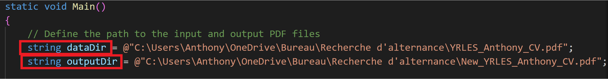

# CahierDeVacance

Welcome to my vacancies journey! I'm going to try to complete a task each day to expand my skills.

## Day One PdfDecryption

The primary task here was simply to open a PDF file, decode it, change one word, and re-encode a new PDF. I added some difficulty by hashing the entirety of the file. If you want to test it, here are the steps to follow:

### Prerequisites

1. **.NET SDK** You need to have .NET SDK installed on your systeme. If you don't have it you can download from [Microsoft .NET](https://dotnet.microsoft.com/fr-fr/download). Don't forget to had dotnet to your PATH.

### Setup

2. **Install Aspose.Pdf Library** Install Aspose library using this command : dotnet add package Aspose.Pdf

3. **Change the pdf Directory** Update the PDF directory path in the code. Refer to the image for guidance

### Commands

4. **Run the project** Use the following commands to run the project:
    dotnet restore
    dotnet build
    dotnet run